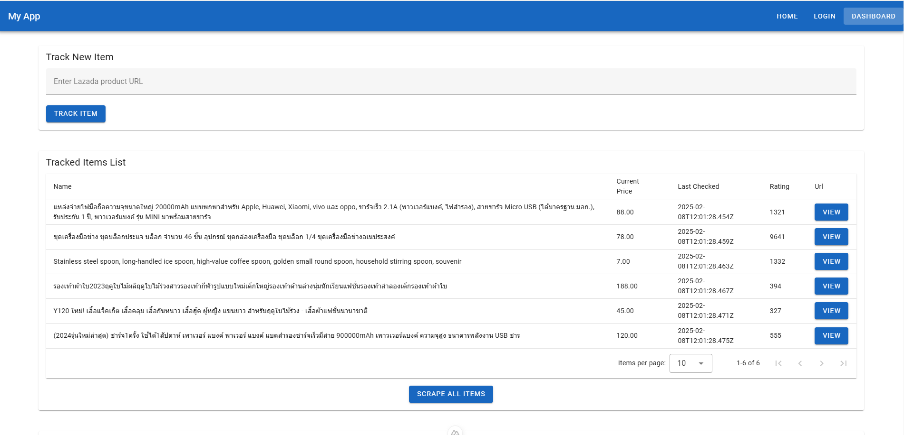
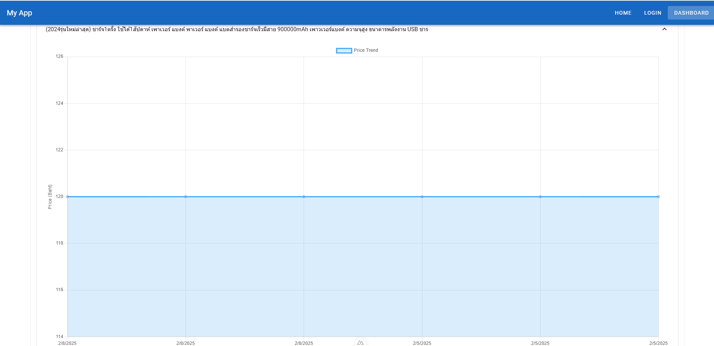

# Online shopping Price Tracker

## Overview

This project is a price tracking web application built with **Nuxt 3 (Vue 3)**, **Vuetify**, **Selenium** **Django**, and **SQLite**. It enables users to monitor product price trends, track their favorite items, and make informed purchasing decisions. Merchants can analyze competitor pricing and ratings to identify market trends.

With **Celery-powered** scheduled scraping, the application automatically updates price data at predefined intervals. Additionally, if a newly scraped price is lower than the previously recorded normal price, the system logs it into a text file for further review.

## Preview



---



## Tech Stack

- **Frontend:** Nuxt 3, Vue 3, Vuetify
- **Backend:** Django (Python)
- **Database:** Sqlite
- **Authentication:** Custom auth using `jwt` composable
- **Scraping:** Selenium or Requests with BeautifulSoup
- **Task Scheduling:** Celery

## Features

- **Product Tracking** – Users can add product URLs and monitor price changes over time.
- **Automated Price Scraping** – Celery schedules periodic scraping of all tracked items.
- **Price History & Analytics** – Detailed visualization of price trends for informed decision-making.
- **Competitive Insights for Merchants** – Analyzes competitor ratings and highlights trending products.
- **Smart Price Alerts** – If a price drop is detected, it is logged into a text file for reference

### Frontend

- **User Authentication** (Login/Logout with session management)
- **Track New Items** (Users input Lazada product URLs)
- **Tracked Items List** (View and manage tracked items)
- **Price History** (View historical price changes)
- **Scrape All Items Button** (Trigger backend scraping for all tracked items)

### Backend

- **User Authentication API** (`/api/auth/`)
- **Add Tracked Item** (`/api/add/`)
- **List Tracked Items** (`/api/show/`)
- **Fetch Price History** (`/api/history/`)
- **Scrape All Tracked Items** (`/api/all/`)

## Setup Instructions

### Prerequisites

- **Node.js & pnpm** (for frontend)
- **Python** (for backend)
- **Chrome driver** (as in environment path)
- **Docker** (for Redis)

### Installation

#### 1. Clone Repository

```sh
git clone https://github.com/yourusername/WebTracker.git
cd WebTracker
```

#### 2. Install Frontend Dependencies and Run Frontend

```sh
cd frontend
pnpm install
pnpm run dev
```

Alternatively, you can use the **make** command:

```sh
make irFrontend
```

#### 3. Install Backend Dependencies && Migration && Start django

```sh
cd backend
pip install -r requirements.txt
python manage.py makemigrations
python manage.py migrate
```

Alternatively, you can use the **make** command:

```sh
make irBackend
```

#### 4. Run Celery on backend for task scheduler

```sh
docker-compose up -d
cd backend
celery -A tracker beat --loglevel=info
celery -A tracker worker --loglevel=info -P eventlet
```

Alternatively, you can use the **make** command:

```sh
make docker
make beat
make worker
```

## API Endpoints

| Method | Endpoint | Description |
|--------|---------|-------------|
| `POST` | `/api/add/` | Add a new tracked item |
| `GET` | `/api/show/` | Get all tracked items |
| `GET` | `/api/history/` | Get price history |
| `POST` | `/api/all/` | Scrape all tracked items |

## Usage

- **Add Products** – Enter product URLs to track price changes.
- **Monitor Trends** – View historical price fluctuations.
- **Automated Scraping** – Celery updates price data on a scheduled basis.
- **Price Drop Alerts** – If a price drops below the normal value, it is logged in a text file (price_alerts.txt).
