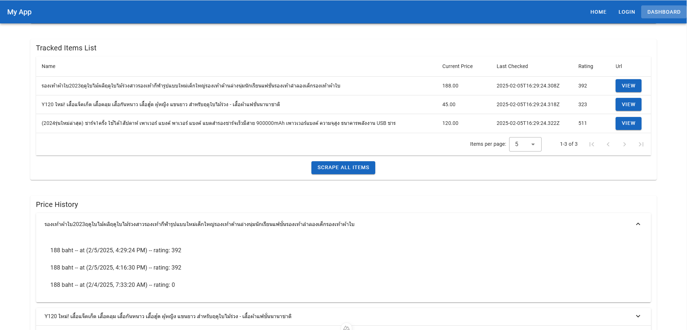

# Online shopping Price Tracker

---

## Overview

This project is a **price tracking web application** built with **Nuxt 3 (Vue 3), Vuetify, Django, and SQLite**. It allows users to track their favorite products, monitor price trends, and make informed purchasing decisions. Additionally, merchants can analyze competitor ratings to identify trending items. Users can add product URLs, view detailed price history, and trigger scraping for all tracked items.

## Preview



## Tech Stack

- **Frontend:** Nuxt 3, Vue 3, Vuetify
- **Backend:** Django (Python)
- **Database:** Sqlite
- **Authentication:** Custom auth using `jwt` composable
- **Scraping:** Selenium or Requests with BeautifulSoup

## Features

### Frontend

- **User Authentication** (Login/Logout with session management)
- **Track New Items** (Users input Lazada product URLs)
- **Tracked Items List** (View and manage tracked items)
- **Price History** (View historical price changes)
- **Scrape All Items Button** (Trigger backend scraping for all tracked items)

### Backend

- **User Authentication API** (`/api/auth/`)
- **Add Tracked Item** (`/api/add/`)
- **List Tracked Items** (`/api/show/`)
- **Fetch Price History** (`/api/history/`)
- **Scrape All Tracked Items** (`/api/all/`)

## Setup Instructions

### Prerequisites

- **Node.js & yarn** (for frontend)
- **Python** (for backend)
- **Chrome driver** (as in environment path)

### Installation

#### 1. Clone Repository

```sh
git clone https://github.com/yourusername/WebTracker.git
cd WebTracker
```

#### 2. Install Frontend Dependencies

```sh
cd frontend
yarn add
```

#### 3. Install Backend Dependencies

```sh
cd backend
pip install -r requirements.txt
```

#### 4. Run Frontend && Run Backend

```sh
cd WebTracker
make r
make dev
```

## API Endpoints

| Method | Endpoint | Description |
|--------|---------|-------------|
| `POST` | `/api/add/` | Add a new tracked item |
| `GET` | `/api/show/` | Get all tracked items |
| `GET` | `/api/history/` | Get price history |
| `POST` | `/api/all/` | Scrape all tracked items |


